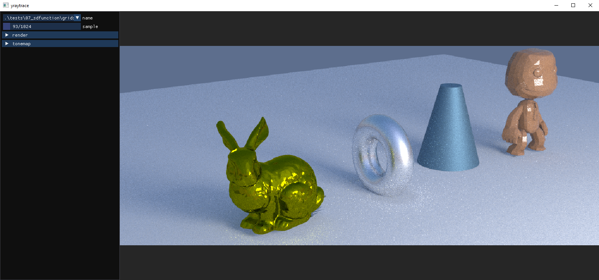
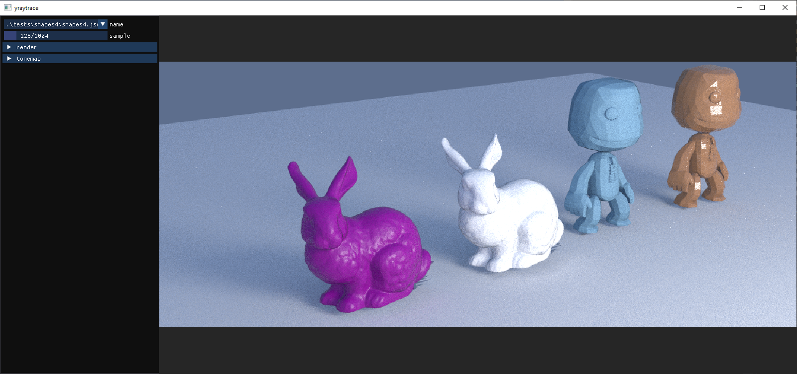

# Yocto/Pathtrace: Tiny Volumetric Path Tracer

For this homework the main objectives were to:
- handle subdivision surfaces,
- handle normal mapping,
- write a path tracer with support for homogeneous volumes.
- write a path tracer that uses sphere tracing for implicit surfaces
- represents implicit surfaces using SDF both as actual functions and as voxel grid.

## Framework

The code uses the library [Yocto/GL](https://github.com/xelatihy/yocto-gl),
that is included in this project in the directory `yocto`.

In order to compile the code, you have to install
[Xcode](https://apps.apple.com/it/app/xcode/id497799835?mt=12)
on OsX, [Visual Studio 2019](https://visualstudio.microsoft.com/it/vs/) on Windows,
or a modern version of gcc or clang on Linux,
together with the tools [cmake](www.cmake.org) and [ninja](https://ninja-build.org).
The script `scripts/build.sh` will perform a simple build on OsX.

Main functionalities can be found in `yocto_pathtrace.{cpp|h}`

This repository also contains tests that are executed from the command line
as shown in `run.sh`. The rendered images are saved in the `out/` directory.
The results can be compared with the ones in the directory `check/`.

## Functionality

In this homework/project the following features are implemented:

- **Subdivision Surfaces** in function `tesselate_surface()`, following Catmull-Clark subdivision implementation
- **Volumetric Path Tracing** in function `shade_volpathtrace()`

## Extra Functionality (implicit surfaces)

Until now we have always used triangle or quad meshes in our renderers;
this extra credit aims to implement a renderer similar to the one implemented in
the second homework but which can render scenes containing **ONLY implicit
surfaces**.

In particular, this implementation allows to render scenes composed by SDF
(signed distance function), such as:
- In-app defined SDF (lambda functions).
- 3D Grid SDF (volume grid).

Following functionalities are implemented:
- Implicit surfaces shader.
- Very simple multiple importance sampling.
- Implicit normals shader for debugging.
- Spheretracing functions.
- Normal evaluation functions.
- `".sdf"` file parsing.
- Implicit scene loading using `"scene.json"`.

Extra information about **implicit surfaces** implementation can be found in `report.pdf`

## Some renders

